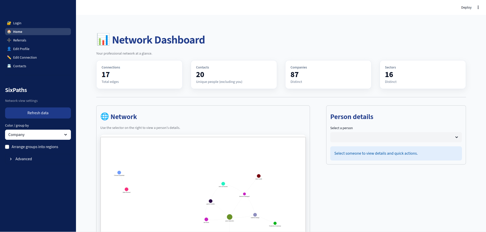
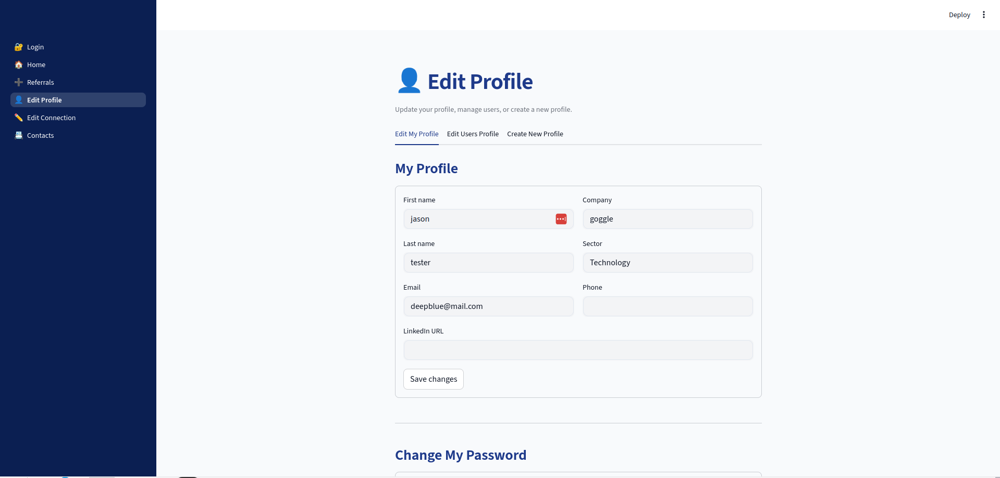
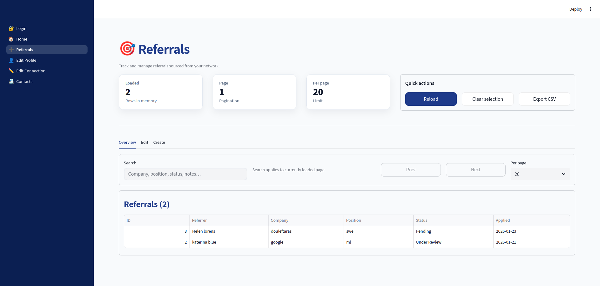
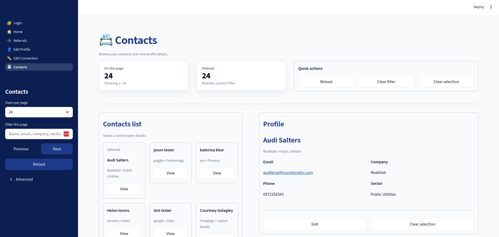

# SixPath

SixPaths is a self-hosted professional network visualization and management tool that helps you map and maintain your connections through an interactive graph interface.
Overview

SixPaths allows you to visualize your professional network as an interactive node graph, with yourself at the center and your connections branching out by sector, company, or relationship type. Unlike traditional contact management systems that use lists or tables, SixPaths provides a spatial, visual representation of how your network connects—inspired by the concept of six degrees of separation.

## Pages

### Login page

Login with username and password. On first run, create the initial admin account. After that, only login is available to maintain security.

### Dashboard

The dashboard displays your network graph where you can add connections, organize them by categories, and track your professional relationships visually.

### Profile Page

The profile page allows you to view and edit your personal information, including your name, email, and password as well as the info of other users inside the system.

### Connection Detail Page

The connection detail page allows you to view and edit detailed information about each contact, including notes on how you met them and the context of your relationship.

### Referral Page

The referral page helps you track and manage referrals between your connections, making it easy to see who referred you.

### Contacts Page

The contacts page provides a list view of all your connections, with their info.

## Key Features

Interactive Network Visualization: View your entire professional network as a dynamic graph with customizable layouts and groupings

Sector & Company Grouping: Organize connections by industry sectors (lawyers, real estate, tech) or companies with color coding

Editable Connections: Click any node to edit detailed information about that contact, including how you met them, notes, and relationship context

Multi-Connection Support: Nodes can connect to multiple people, reflecting real-world referral networks and mutual connections

Referral Tracking: Dedicated page to track and manage referrals between your connections

Self-Hosted & Private: Complete control over your data with FastAPI backend and streamlined deployment

Modern Tech Stack: Built with Streamlit frontend, FastAPI backend, and Pydantic models for type-safe API communication

## Use Cases

- Freelancers & Consultants: Track referral sources and visualize how clients connect to each other

- Sales & Business Development: Map stakeholder relationships by sector and company

- Professional Networkers: Maintain detailed records of how you know people and when you met them

- Privacy-Conscious Users: Self-host your contact network without relying on cloud CRM services

## Tech Stack

- Frontend: Streamlit with PyVis for interactive network graphs

- Backend: FastAPI with SQLAlchemy ORM

- Database: PostgreSQL (or SQLite for lightweight deployments)

- Models: Pydantic for request/response validation

- Authentication: JWT-based auth with secure token management

## Getting Started

On first run, create the initial admin account. After that, only login is available to maintain security. The dashboard displays your network graph where you can add connections, organize them by categories, and track your professional relationships visually.
